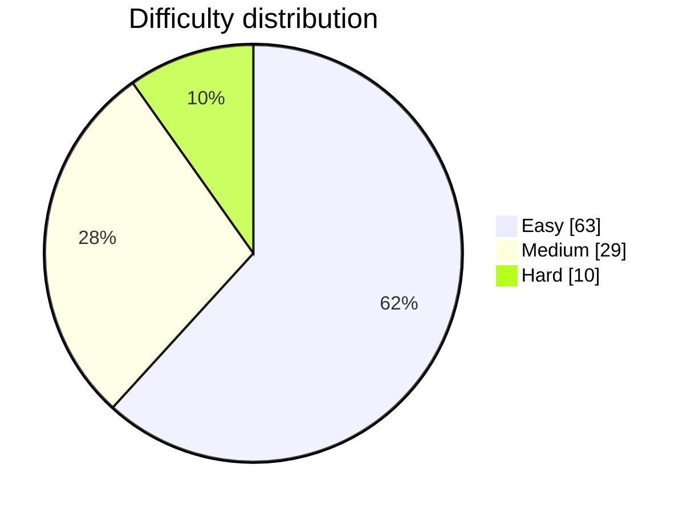

<div align="center">

# 🧠 The DSA Diary

### Building stronger problem-solving instincts, one LeetCode solution at a time.

<p>
  
  
  
</p>

> A living archive of my Data Structures & Algorithms journey — focused on patterns, clarity, and consistent practice.

</div>

---

## 📊 Progress dashboard

<div align="center">

| 🧩 Problems solved | 🟢 Easy | 🟡 Medium | 🔴 Hard |
| :---: | :---: | :---: | :---: |
| **102** | **63** | **29** | **10** |

-0EA5E9?style=for-the-badge&labelColor=0F172A)

</div>



<sub>Snapshot sourced from <a href="./stats.json">stats.json</a> · updated whenever this README is refreshed.</sub>

---

## ✨ What lives here

Every accepted LeetCode submission is synced into its own folder through **LeetHub v2**. Each solution is a small checkpoint in a larger habit: recognize the pattern, choose the right tool, and improve the approach.

| What I practice | What I’m building |
| --- | --- |
| Arrays, strings, hash maps, linked lists, stacks, queues | Strong fundamentals and clean implementation habits |
| Trees, graphs, heaps, binary search, recursion | Pattern recognition and structured reasoning |
| Backtracking, greedy, dynamic programming | Confidence with higher-complexity interview problems |

---

## 🗺️ Learning roadmap

```mermaid
flowchart LR
    A["🟢 Foundations<br/>Arrays · Strings · Hashing"] --> B["🟢 Core patterns<br/>Linked Lists · Stacks · Queues"]
    B --> C["🟢 Data structures<br/>Trees · Heaps · Binary Search"]
    C --> D["🟡 In progress<br/>Graphs · Backtracking · Greedy"]
    D --> E["🟠 Next up<br/>Dynamic Programming"]
    E --> F["🔴 Advanced<br/>Graph algorithms · Optimization"]

    classDef done fill:#dcfce7,stroke:#16a34a,color:#14532d;
    classDef progress fill:#fef3c7,stroke:#d97706,color:#78350f;
    classDef next fill:#ffedd5,stroke:#ea580c,color:#7c2d12;
    classDef advanced fill:#fee2e2,stroke:#dc2626,color:#7f1d1d;

    class A,B,C done;
    class D progress;
    class E next;
    class F advanced;
```



---

## 🗂️ Repository structure

```text
TheDSADiary/
├── 0001-two-sum/
│   ├── 0001-two-sum.java
│   └── README.md
├── 0020-valid-parentheses/
│   ├── 0020-valid-parentheses.java
│   └── README.md
├── stats.json
└── README.md
```

Each problem folder typically includes the accepted Java solution, problem notes, approach, and complexity details.

---

## 🎯 Current mission

- [x] Build a sustainable DSA practice habit
- [x] Learn and connect core algorithmic patterns
- [x] Solve across Easy, Medium, and Hard difficulty levels
- [ ] Reach **500 solved problems**
- [ ] Strengthen dynamic programming and advanced graph skills
- [ ] Turn practice into interview confidence

> **Don’t memorize answers. Learn the pattern, practice deliberately, then revisit and improve.**

---

## 📚 LeetCode topics & solutions

> The section below is maintained automatically by LeetHub v2.

<!-- KEEP YOUR CURRENT AUTO GENERATED TOPIC LIST BELOW THIS LINE -->

<!---LeetCode Topics Start-->
# LeetCode Topics
## Array
|  |
| ------- |
| [0033-search-in-rotated-sorted-array](https://github.com/Kasa1905/TheDSADiary/tree/master/0033-search-in-rotated-sorted-array) |
| [0039-combination-sum](https://github.com/Kasa1905/TheDSADiary/tree/master/0039-combination-sum) |
| [0042-trapping-rain-water](https://github.com/Kasa1905/TheDSADiary/tree/master/0042-trapping-rain-water) |
| [0049-group-anagrams](https://github.com/Kasa1905/TheDSADiary/tree/master/0049-group-anagrams) |
| [0055-jump-game](https://github.com/Kasa1905/TheDSADiary/tree/master/0055-jump-game) |
| [0056-merge-intervals](https://github.com/Kasa1905/TheDSADiary/tree/master/0056-merge-intervals) |
| [0134-gas-station](https://github.com/Kasa1905/TheDSADiary/tree/master/0134-gas-station) |
| [2846-minimum-edge-weight-equilibrium-queries-in-a-tree](https://github.com/Kasa1905/TheDSADiary/tree/master/2846-minimum-edge-weight-equilibrium-queries-in-a-tree) |
| [2948-make-lexicographically-smallest-array-by-swapping-elements](https://github.com/Kasa1905/TheDSADiary/tree/master/2948-make-lexicographically-smallest-array-by-swapping-elements) |
| [3336-find-the-number-of-subsequences-with-equal-gcd](https://github.com/Kasa1905/TheDSADiary/tree/master/3336-find-the-number-of-subsequences-with-equal-gcd) |
## Math
|  |
| ------- |
| [3336-find-the-number-of-subsequences-with-equal-gcd](https://github.com/Kasa1905/TheDSADiary/tree/master/3336-find-the-number-of-subsequences-with-equal-gcd) |
| [3658-gcd-of-odd-and-even-sums](https://github.com/Kasa1905/TheDSADiary/tree/master/3658-gcd-of-odd-and-even-sums) |
## Dynamic Programming
|  |
| ------- |
| [0042-trapping-rain-water](https://github.com/Kasa1905/TheDSADiary/tree/master/0042-trapping-rain-water) |
| [0055-jump-game](https://github.com/Kasa1905/TheDSADiary/tree/master/0055-jump-game) |
| [2846-minimum-edge-weight-equilibrium-queries-in-a-tree](https://github.com/Kasa1905/TheDSADiary/tree/master/2846-minimum-edge-weight-equilibrium-queries-in-a-tree) |
| [3336-find-the-number-of-subsequences-with-equal-gcd](https://github.com/Kasa1905/TheDSADiary/tree/master/3336-find-the-number-of-subsequences-with-equal-gcd) |
## Number Theory
|  |
| ------- |
| [3336-find-the-number-of-subsequences-with-equal-gcd](https://github.com/Kasa1905/TheDSADiary/tree/master/3336-find-the-number-of-subsequences-with-equal-gcd) |
| [3658-gcd-of-odd-and-even-sums](https://github.com/Kasa1905/TheDSADiary/tree/master/3658-gcd-of-odd-and-even-sums) |
## Greedy
|  |
| ------- |
| [0055-jump-game](https://github.com/Kasa1905/TheDSADiary/tree/master/0055-jump-game) |
| [0134-gas-station](https://github.com/Kasa1905/TheDSADiary/tree/master/0134-gas-station) |
## Union-Find
|  |
| ------- |
| [2948-make-lexicographically-smallest-array-by-swapping-elements](https://github.com/Kasa1905/TheDSADiary/tree/master/2948-make-lexicographically-smallest-array-by-swapping-elements) |
## Sorting
|  |
| ------- |
| [0049-group-anagrams](https://github.com/Kasa1905/TheDSADiary/tree/master/0049-group-anagrams) |
| [0056-merge-intervals](https://github.com/Kasa1905/TheDSADiary/tree/master/0056-merge-intervals) |
| [2948-make-lexicographically-smallest-array-by-swapping-elements](https://github.com/Kasa1905/TheDSADiary/tree/master/2948-make-lexicographically-smallest-array-by-swapping-elements) |
## Bit Manipulation
|  |
| ------- |
| [2846-minimum-edge-weight-equilibrium-queries-in-a-tree](https://github.com/Kasa1905/TheDSADiary/tree/master/2846-minimum-edge-weight-equilibrium-queries-in-a-tree) |
## Tree
|  |
| ------- |
| [2846-minimum-edge-weight-equilibrium-queries-in-a-tree](https://github.com/Kasa1905/TheDSADiary/tree/master/2846-minimum-edge-weight-equilibrium-queries-in-a-tree) |
## Depth-First Search
|  |
| ------- |
| [2846-minimum-edge-weight-equilibrium-queries-in-a-tree](https://github.com/Kasa1905/TheDSADiary/tree/master/2846-minimum-edge-weight-equilibrium-queries-in-a-tree) |
## Hash Table
|  |
| ------- |
| [0003-longest-substring-without-repeating-characters](https://github.com/Kasa1905/TheDSADiary/tree/master/0003-longest-substring-without-repeating-characters) |
| [0049-group-anagrams](https://github.com/Kasa1905/TheDSADiary/tree/master/0049-group-anagrams) |
## String
|  |
| ------- |
| [0003-longest-substring-without-repeating-characters](https://github.com/Kasa1905/TheDSADiary/tree/master/0003-longest-substring-without-repeating-characters) |
| [0049-group-anagrams](https://github.com/Kasa1905/TheDSADiary/tree/master/0049-group-anagrams) |
## Sliding Window
|  |
| ------- |
| [0003-longest-substring-without-repeating-characters](https://github.com/Kasa1905/TheDSADiary/tree/master/0003-longest-substring-without-repeating-characters) |
## Binary Search
|  |
| ------- |
| [0033-search-in-rotated-sorted-array](https://github.com/Kasa1905/TheDSADiary/tree/master/0033-search-in-rotated-sorted-array) |
## Backtracking
|  |
| ------- |
| [0039-combination-sum](https://github.com/Kasa1905/TheDSADiary/tree/master/0039-combination-sum) |
## Two Pointers
|  |
| ------- |
| [0042-trapping-rain-water](https://github.com/Kasa1905/TheDSADiary/tree/master/0042-trapping-rain-water) |
## Stack
|  |
| ------- |
| [0042-trapping-rain-water](https://github.com/Kasa1905/TheDSADiary/tree/master/0042-trapping-rain-water) |
## Monotonic Stack
|  |
| ------- |
| [0042-trapping-rain-water](https://github.com/Kasa1905/TheDSADiary/tree/master/0042-trapping-rain-water) |
<!---LeetCode Topics End-->