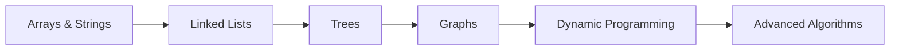

<div align="center">

# 🧠 The DSA Diary

### 💻 Solving Problems • 🧩 Understanding Patterns • 🚀 Becoming a Better Engineer


<p>
  <b>A living archive of my Data Structures & Algorithms journey</b>
</p>

<p>
  <i>"Consistency beats intensity."</i>
</p>

<br/>


</div>

# 👋 About The Repository

Welcome to **The DSA Diary** — my personal collection of solved **LeetCode problems**, automatically synced using **LeetHub v2**.

This repository is not just a collection of solutions.

It represents:

* 🧠 patterns discovered while solving problems
* 📝 concepts reinforced through practice
* ⚡ optimization techniques learned
* 📈 continuous growth as a problem solver

Every accepted submission becomes another entry in my DSA journey.

---

# 📊 DSA Progress Dashboard

<div align="center">


</div>

## 🏆 Current Journey

| Category        | Progress                |
| --------------- | ----------------------- |
| Problems Solved | 🚀 Continuously Growing |
| Language        | ☕ Java                  |
| Platform        | 💻 LeetCode             |
| Sync Automation | 🔄 LeetHub v2           |
| Goal            | 🎯 Master DSA Patterns  |

---

# 🧩 Topics Covered

<div align="center">

| Topic                     | Status |
| ------------------------- | ------ |
| Arrays                    | ✅      |
| Strings                   | ✅      |
| Hash Maps                 | ✅      |
| Linked Lists              | ✅      |
| Stack                     | ✅      |
| Queue                     | ✅      |
| Trees                     | ✅      |
| Graphs                    | ✅      |
| Heap / Priority Queue     | ✅      |
| Binary Search             | ✅      |
| Recursion                 | ✅      |
| Backtracking              | ✅      |
| Greedy                    | ✅      |
| Dynamic Programming       | 🚧     |
| Advanced Graph Algorithms | 🚧     |

</div>

---

# 🗂️ Repository Structure

Each LeetCode submission is automatically organized into its own folder.

```
TheDSADiary
│
├── README.md
│
├── 0001-two-sum
│   ├── README.md
│   └── 0001-two-sum.java
│
├── 0020-valid-parentheses
│   ├── README.md
│   └── 0020-valid-parentheses.java
│
└── ...
```

Each problem contains:

```
📄 Problem explanation
💡 Approach
⌛ Complexity analysis
✅ Accepted Java solution
🏷️ Related concepts
```

---

# 🛠️ Tech Stack

<div align="center">


</div>

---

# 🎯 Goals

* [x] Build consistency with daily DSA practice
* [x] Learn algorithmic patterns
* [x] Improve problem-solving ability
* [ ] Solve 500+ LeetCode problems
* [ ] Master advanced algorithms
* [ ] Become interview-ready

---

# 💭 Learning Philosophy

```
Don't memorize solutions.

Understand the pattern.

Practice consistently.

Improve the approach.

Repeat.
```

---

# 📈 My DSA Roadmap



---

# 🤝 Join The Journey

If you are also learning DSA:

⭐ Explore the solutions
🧠 Compare approaches
🚀 Learn patterns
📚 Keep practicing

<div align="center">

## Happy Coding! 🚀

</div>

---

# 📚 LeetCode Topics & Solutions

> The following section is automatically generated by LeetHub v2.

<!-- KEEP YOUR CURRENT AUTO GENERATED TOPIC LIST BELOW THIS LINE -->
