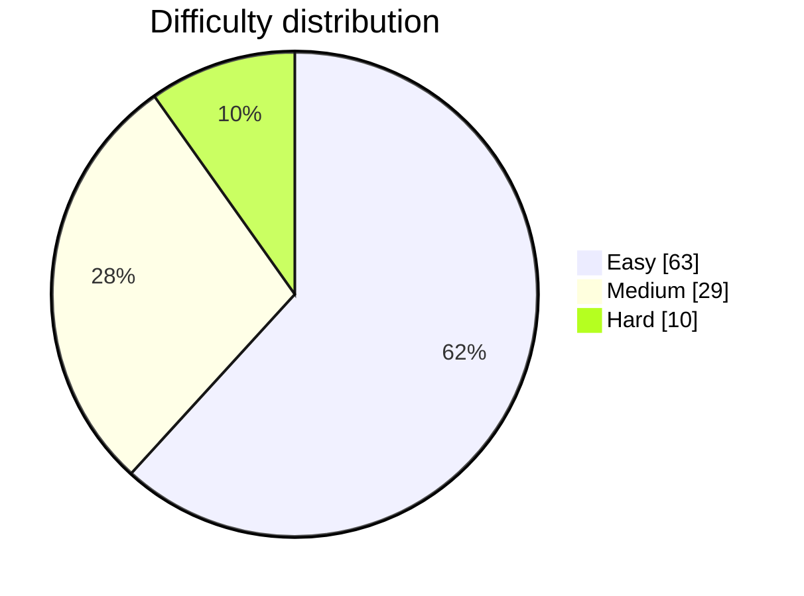

<div align="center">

# 🧠 The DSA Diary

### Building stronger problem-solving instincts, one LeetCode solution at a time.

<p>
  
  
  
</p>

> A living archive of my Data Structures & Algorithms journey — focused on patterns, clarity, and consistent practice.

</div>

---

## 📊 Progress dashboard

<div align="center">

| 🧩 Problems solved | 🟢 Easy | 🟡 Medium | 🔴 Hard |
| :---: | :---: | :---: | :---: |
| **102** | **63** | **29** | **10** |

-0EA5E9?style=for-the-badge&labelColor=0F172A)

</div>


```mermaid
pie showData
    title Difficulty distribution
    "Easy" : 63
    "Medium" : 29
    "Hard" : 10
```

<sub>Snapshot sourced from <a href="./stats.json">stats.json</a> · updated whenever this README is refreshed.</sub>

---

## ✨ What lives here

Every accepted LeetCode submission is synced into its own folder through **LeetHub v2**. Each solution is a small checkpoint in a larger habit: recognize the pattern, choose the right tool, and improve the approach.

| What I practice | What I’m building |
| --- | --- |
| Arrays, strings, hash maps, linked lists, stacks, queues | Strong fundamentals and clean implementation habits |
| Trees, graphs, heaps, binary search, recursion | Pattern recognition and structured reasoning |
| Backtracking, greedy, dynamic programming | Confidence with higher-complexity interview problems |

---

## 🗺️ Learning roadmap


```mermaid
flowchart LR
    A["🟢 Foundations<br/>Arrays · Strings · Hashing"] --> B["🟢 Core patterns<br/>Linked Lists · Stacks · Queues"]
    B --> C["🟢 Data structures<br/>Trees · Heaps · Binary Search"]
    C --> D["🟡 In progress<br/>Graphs · Backtracking · Greedy"]
    D --> E["🟠 Next up<br/>Dynamic Programming"]
    E --> F["🔴 Advanced<br/>Graph algorithms · Optimization"]

    classDef done fill:#dcfce7,stroke:#16a34a,color:#14532d;
    classDef progress fill:#fef3c7,stroke:#d97706,color:#78350f;
    classDef next fill:#ffedd5,stroke:#ea580c,color:#7c2d12;
    classDef advanced fill:#fee2e2,stroke:#dc2626,color:#7f1d1d;

    class A,B,C done;
    class D progress;
    class E next;
    class F advanced;
```

---

## 🗂️ Repository structure

```text
TheDSADiary/
├── 0001-two-sum/
│   ├── 0001-two-sum.java
│   └── README.md
├── 0020-valid-parentheses/
│   ├── 0020-valid-parentheses.java
│   └── README.md
├── stats.json
└── README.md
```

Each problem folder typically includes the accepted Java solution, problem notes, approach, and complexity details.

---

## 🎯 Current mission

- [x] Build a sustainable DSA practice habit
- [x] Learn and connect core algorithmic patterns
- [x] Solve across Easy, Medium, and Hard difficulty levels
- [ ] Reach **500 solved problems**
- [ ] Strengthen dynamic programming and advanced graph skills
- [ ] Turn practice into interview confidence

> **Don’t memorize answers. Learn the pattern, practice deliberately, then revisit and improve.**

---

## 📚 LeetCode topics & solutions

> The section below is maintained automatically by LeetHub v2.

<!-- KEEP YOUR CURRENT AUTO GENERATED TOPIC LIST BELOW THIS LINE -->

<!---LeetCode Topics Start-->
# LeetCode Topics
## Array
|  |
| ------- |
| [0004-median-of-two-sorted-arrays](https://github.com/Kasa1905/TheDSADiary/tree/master/0004-median-of-two-sorted-arrays) |
| [0011-container-with-most-water](https://github.com/Kasa1905/TheDSADiary/tree/master/0011-container-with-most-water) |
| [0015-3sum](https://github.com/Kasa1905/TheDSADiary/tree/master/0015-3sum) |
| [0016-3sum-closest](https://github.com/Kasa1905/TheDSADiary/tree/master/0016-3sum-closest) |
| [0018-4sum](https://github.com/Kasa1905/TheDSADiary/tree/master/0018-4sum) |
| [0031-next-permutation](https://github.com/Kasa1905/TheDSADiary/tree/master/0031-next-permutation) |
| [0033-search-in-rotated-sorted-array](https://github.com/Kasa1905/TheDSADiary/tree/master/0033-search-in-rotated-sorted-array) |
| [0034-find-first-and-last-position-of-element-in-sorted-array](https://github.com/Kasa1905/TheDSADiary/tree/master/0034-find-first-and-last-position-of-element-in-sorted-array) |
| [0036-valid-sudoku](https://github.com/Kasa1905/TheDSADiary/tree/master/0036-valid-sudoku) |
| [0037-sudoku-solver](https://github.com/Kasa1905/TheDSADiary/tree/master/0037-sudoku-solver) |
| [0039-combination-sum](https://github.com/Kasa1905/TheDSADiary/tree/master/0039-combination-sum) |
| [0040-combination-sum-ii](https://github.com/Kasa1905/TheDSADiary/tree/master/0040-combination-sum-ii) |
| [0041-first-missing-positive](https://github.com/Kasa1905/TheDSADiary/tree/master/0041-first-missing-positive) |
| [0042-trapping-rain-water](https://github.com/Kasa1905/TheDSADiary/tree/master/0042-trapping-rain-water) |
| [0045-jump-game-ii](https://github.com/Kasa1905/TheDSADiary/tree/master/0045-jump-game-ii) |
| [0046-permutations](https://github.com/Kasa1905/TheDSADiary/tree/master/0046-permutations) |
| [0047-permutations-ii](https://github.com/Kasa1905/TheDSADiary/tree/master/0047-permutations-ii) |
| [0048-rotate-image](https://github.com/Kasa1905/TheDSADiary/tree/master/0048-rotate-image) |
| [0049-group-anagrams](https://github.com/Kasa1905/TheDSADiary/tree/master/0049-group-anagrams) |
| [0051-n-queens](https://github.com/Kasa1905/TheDSADiary/tree/master/0051-n-queens) |
| [0053-maximum-subarray](https://github.com/Kasa1905/TheDSADiary/tree/master/0053-maximum-subarray) |
| [0054-spiral-matrix](https://github.com/Kasa1905/TheDSADiary/tree/master/0054-spiral-matrix) |
| [0055-jump-game](https://github.com/Kasa1905/TheDSADiary/tree/master/0055-jump-game) |
| [0056-merge-intervals](https://github.com/Kasa1905/TheDSADiary/tree/master/0056-merge-intervals) |
| [0057-insert-interval](https://github.com/Kasa1905/TheDSADiary/tree/master/0057-insert-interval) |
| [0063-unique-paths-ii](https://github.com/Kasa1905/TheDSADiary/tree/master/0063-unique-paths-ii) |
| [0064-minimum-path-sum](https://github.com/Kasa1905/TheDSADiary/tree/master/0064-minimum-path-sum) |
| [0068-text-justification](https://github.com/Kasa1905/TheDSADiary/tree/master/0068-text-justification) |
| [0073-set-matrix-zeroes](https://github.com/Kasa1905/TheDSADiary/tree/master/0073-set-matrix-zeroes) |
| [0074-search-a-2d-matrix](https://github.com/Kasa1905/TheDSADiary/tree/master/0074-search-a-2d-matrix) |
| [0075-sort-colors](https://github.com/Kasa1905/TheDSADiary/tree/master/0075-sort-colors) |
| [0078-subsets](https://github.com/Kasa1905/TheDSADiary/tree/master/0078-subsets) |
| [0079-word-search](https://github.com/Kasa1905/TheDSADiary/tree/master/0079-word-search) |
| [0080-remove-duplicates-from-sorted-array-ii](https://github.com/Kasa1905/TheDSADiary/tree/master/0080-remove-duplicates-from-sorted-array-ii) |
| [0081-search-in-rotated-sorted-array-ii](https://github.com/Kasa1905/TheDSADiary/tree/master/0081-search-in-rotated-sorted-array-ii) |
| [0084-largest-rectangle-in-histogram](https://github.com/Kasa1905/TheDSADiary/tree/master/0084-largest-rectangle-in-histogram) |
| [0090-subsets-ii](https://github.com/Kasa1905/TheDSADiary/tree/master/0090-subsets-ii) |
| [0105-construct-binary-tree-from-preorder-and-inorder-traversal](https://github.com/Kasa1905/TheDSADiary/tree/master/0105-construct-binary-tree-from-preorder-and-inorder-traversal) |
| [0106-construct-binary-tree-from-inorder-and-postorder-traversal](https://github.com/Kasa1905/TheDSADiary/tree/master/0106-construct-binary-tree-from-inorder-and-postorder-traversal) |
| [0134-gas-station](https://github.com/Kasa1905/TheDSADiary/tree/master/0134-gas-station) |
| [0169-majority-element](https://github.com/Kasa1905/TheDSADiary/tree/master/0169-majority-element) |
| [0268-missing-number](https://github.com/Kasa1905/TheDSADiary/tree/master/0268-missing-number) |
| [0486-predict-the-winner](https://github.com/Kasa1905/TheDSADiary/tree/master/0486-predict-the-winner) |
| [0561-array-partition](https://github.com/Kasa1905/TheDSADiary/tree/master/0561-array-partition) |
| [0628-maximum-product-of-three-numbers](https://github.com/Kasa1905/TheDSADiary/tree/master/0628-maximum-product-of-three-numbers) |
| [0877-stone-game](https://github.com/Kasa1905/TheDSADiary/tree/master/0877-stone-game) |
| [0888-fair-candy-swap](https://github.com/Kasa1905/TheDSADiary/tree/master/0888-fair-candy-swap) |
| [1140-stone-game-ii](https://github.com/Kasa1905/TheDSADiary/tree/master/1140-stone-game-ii) |
| [1260-shift-2d-grid](https://github.com/Kasa1905/TheDSADiary/tree/master/1260-shift-2d-grid) |
| [1386-cinema-seat-allocation](https://github.com/Kasa1905/TheDSADiary/tree/master/1386-cinema-seat-allocation) |
| [1406-stone-game-iii](https://github.com/Kasa1905/TheDSADiary/tree/master/1406-stone-game-iii) |
| [1464-maximum-product-of-two-elements-in-an-array](https://github.com/Kasa1905/TheDSADiary/tree/master/1464-maximum-product-of-two-elements-in-an-array) |
| [1563-stone-game-v](https://github.com/Kasa1905/TheDSADiary/tree/master/1563-stone-game-v) |
| [1872-stone-game-viii](https://github.com/Kasa1905/TheDSADiary/tree/master/1872-stone-game-viii) |
| [1979-find-greatest-common-divisor-of-array](https://github.com/Kasa1905/TheDSADiary/tree/master/1979-find-greatest-common-divisor-of-array) |
| [2029-stone-game-ix](https://github.com/Kasa1905/TheDSADiary/tree/master/2029-stone-game-ix) |
| [2144-minimum-cost-of-buying-candies-with-discount](https://github.com/Kasa1905/TheDSADiary/tree/master/2144-minimum-cost-of-buying-candies-with-discount) |
| [2213-longest-substring-of-one-repeating-character](https://github.com/Kasa1905/TheDSADiary/tree/master/2213-longest-substring-of-one-repeating-character) |
| [2846-minimum-edge-weight-equilibrium-queries-in-a-tree](https://github.com/Kasa1905/TheDSADiary/tree/master/2846-minimum-edge-weight-equilibrium-queries-in-a-tree) |
| [2948-make-lexicographically-smallest-array-by-swapping-elements](https://github.com/Kasa1905/TheDSADiary/tree/master/2948-make-lexicographically-smallest-array-by-swapping-elements) |
| [2958-length-of-longest-subarray-with-at-most-k-frequency](https://github.com/Kasa1905/TheDSADiary/tree/master/2958-length-of-longest-subarray-with-at-most-k-frequency) |
| [2996-smallest-missing-integer-greater-than-sequential-prefix-sum](https://github.com/Kasa1905/TheDSADiary/tree/master/2996-smallest-missing-integer-greater-than-sequential-prefix-sum) |
| [3069-distribute-elements-into-two-arrays-i](https://github.com/Kasa1905/TheDSADiary/tree/master/3069-distribute-elements-into-two-arrays-i) |
| [3116-kth-smallest-amount-with-single-denomination-combination](https://github.com/Kasa1905/TheDSADiary/tree/master/3116-kth-smallest-amount-with-single-denomination-combination) |
| [3312-sorted-gcd-pair-queries](https://github.com/Kasa1905/TheDSADiary/tree/master/3312-sorted-gcd-pair-queries) |
| [3336-find-the-number-of-subsequences-with-equal-gcd](https://github.com/Kasa1905/TheDSADiary/tree/master/3336-find-the-number-of-subsequences-with-equal-gcd) |
| [3471-find-the-largest-almost-missing-integer](https://github.com/Kasa1905/TheDSADiary/tree/master/3471-find-the-largest-almost-missing-integer) |
| [3501-maximize-active-section-with-trade-ii](https://github.com/Kasa1905/TheDSADiary/tree/master/3501-maximize-active-section-with-trade-ii) |
| [3513-number-of-unique-xor-triplets-i](https://github.com/Kasa1905/TheDSADiary/tree/master/3513-number-of-unique-xor-triplets-i) |
| [3514-number-of-unique-xor-triplets-ii](https://github.com/Kasa1905/TheDSADiary/tree/master/3514-number-of-unique-xor-triplets-ii) |
| [3702-longest-subsequence-with-non-zero-bitwise-xor](https://github.com/Kasa1905/TheDSADiary/tree/master/3702-longest-subsequence-with-non-zero-bitwise-xor) |
| [3867-sum-of-gcd-of-formed-pairs](https://github.com/Kasa1905/TheDSADiary/tree/master/3867-sum-of-gcd-of-formed-pairs) |
## Math
|  |
| ------- |
| [0002-add-two-numbers](https://github.com/Kasa1905/TheDSADiary/tree/master/0002-add-two-numbers) |
| [0007-reverse-integer](https://github.com/Kasa1905/TheDSADiary/tree/master/0007-reverse-integer) |
| [0012-integer-to-roman](https://github.com/Kasa1905/TheDSADiary/tree/master/0012-integer-to-roman) |
| [0029-divide-two-integers](https://github.com/Kasa1905/TheDSADiary/tree/master/0029-divide-two-integers) |
| [0043-multiply-strings](https://github.com/Kasa1905/TheDSADiary/tree/master/0043-multiply-strings) |
| [0048-rotate-image](https://github.com/Kasa1905/TheDSADiary/tree/master/0048-rotate-image) |
| [0050-powx-n](https://github.com/Kasa1905/TheDSADiary/tree/master/0050-powx-n) |
| [0060-permutation-sequence](https://github.com/Kasa1905/TheDSADiary/tree/master/0060-permutation-sequence) |
| [0062-unique-paths](https://github.com/Kasa1905/TheDSADiary/tree/master/0062-unique-paths) |
| [0089-gray-code](https://github.com/Kasa1905/TheDSADiary/tree/master/0089-gray-code) |
| [0096-unique-binary-search-trees](https://github.com/Kasa1905/TheDSADiary/tree/master/0096-unique-binary-search-trees) |
| [0168-excel-sheet-column-title](https://github.com/Kasa1905/TheDSADiary/tree/master/0168-excel-sheet-column-title) |
| [0171-excel-sheet-column-number](https://github.com/Kasa1905/TheDSADiary/tree/master/0171-excel-sheet-column-number) |
| [0263-ugly-number](https://github.com/Kasa1905/TheDSADiary/tree/master/0263-ugly-number) |
| [0268-missing-number](https://github.com/Kasa1905/TheDSADiary/tree/master/0268-missing-number) |
| [0326-power-of-three](https://github.com/Kasa1905/TheDSADiary/tree/master/0326-power-of-three) |
| [0486-predict-the-winner](https://github.com/Kasa1905/TheDSADiary/tree/master/0486-predict-the-winner) |
| [0628-maximum-product-of-three-numbers](https://github.com/Kasa1905/TheDSADiary/tree/master/0628-maximum-product-of-three-numbers) |
| [0877-stone-game](https://github.com/Kasa1905/TheDSADiary/tree/master/0877-stone-game) |
| [1140-stone-game-ii](https://github.com/Kasa1905/TheDSADiary/tree/master/1140-stone-game-ii) |
| [1406-stone-game-iii](https://github.com/Kasa1905/TheDSADiary/tree/master/1406-stone-game-iii) |
| [1510-stone-game-iv](https://github.com/Kasa1905/TheDSADiary/tree/master/1510-stone-game-iv) |
| [1563-stone-game-v](https://github.com/Kasa1905/TheDSADiary/tree/master/1563-stone-game-v) |
| [1872-stone-game-viii](https://github.com/Kasa1905/TheDSADiary/tree/master/1872-stone-game-viii) |
| [1927-sum-game](https://github.com/Kasa1905/TheDSADiary/tree/master/1927-sum-game) |
| [1979-find-greatest-common-divisor-of-array](https://github.com/Kasa1905/TheDSADiary/tree/master/1979-find-greatest-common-divisor-of-array) |
| [2029-stone-game-ix](https://github.com/Kasa1905/TheDSADiary/tree/master/2029-stone-game-ix) |
| [3014-minimum-number-of-pushes-to-type-word-i](https://github.com/Kasa1905/TheDSADiary/tree/master/3014-minimum-number-of-pushes-to-type-word-i) |
| [3116-kth-smallest-amount-with-single-denomination-combination](https://github.com/Kasa1905/TheDSADiary/tree/master/3116-kth-smallest-amount-with-single-denomination-combination) |
| [3312-sorted-gcd-pair-queries](https://github.com/Kasa1905/TheDSADiary/tree/master/3312-sorted-gcd-pair-queries) |
| [3336-find-the-number-of-subsequences-with-equal-gcd](https://github.com/Kasa1905/TheDSADiary/tree/master/3336-find-the-number-of-subsequences-with-equal-gcd) |
| [3345-smallest-divisible-digit-product-i](https://github.com/Kasa1905/TheDSADiary/tree/master/3345-smallest-divisible-digit-product-i) |
| [3348-smallest-divisible-digit-product-ii](https://github.com/Kasa1905/TheDSADiary/tree/master/3348-smallest-divisible-digit-product-ii) |
| [3513-number-of-unique-xor-triplets-i](https://github.com/Kasa1905/TheDSADiary/tree/master/3513-number-of-unique-xor-triplets-i) |
| [3514-number-of-unique-xor-triplets-ii](https://github.com/Kasa1905/TheDSADiary/tree/master/3514-number-of-unique-xor-triplets-ii) |
| [3518-smallest-palindromic-rearrangement-ii](https://github.com/Kasa1905/TheDSADiary/tree/master/3518-smallest-palindromic-rearrangement-ii) |
| [3536-maximum-product-of-two-digits](https://github.com/Kasa1905/TheDSADiary/tree/master/3536-maximum-product-of-two-digits) |
| [3622-check-divisibility-by-digit-sum-and-product](https://github.com/Kasa1905/TheDSADiary/tree/master/3622-check-divisibility-by-digit-sum-and-product) |
| [3658-gcd-of-odd-and-even-sums](https://github.com/Kasa1905/TheDSADiary/tree/master/3658-gcd-of-odd-and-even-sums) |
| [3867-sum-of-gcd-of-formed-pairs](https://github.com/Kasa1905/TheDSADiary/tree/master/3867-sum-of-gcd-of-formed-pairs) |
## Dynamic Programming
|  |
| ------- |
| [0005-longest-palindromic-substring](https://github.com/Kasa1905/TheDSADiary/tree/master/0005-longest-palindromic-substring) |
| [0010-regular-expression-matching](https://github.com/Kasa1905/TheDSADiary/tree/master/0010-regular-expression-matching) |
| [0032-longest-valid-parentheses](https://github.com/Kasa1905/TheDSADiary/tree/master/0032-longest-valid-parentheses) |
| [0042-trapping-rain-water](https://github.com/Kasa1905/TheDSADiary/tree/master/0042-trapping-rain-water) |
| [0044-wildcard-matching](https://github.com/Kasa1905/TheDSADiary/tree/master/0044-wildcard-matching) |
| [0045-jump-game-ii](https://github.com/Kasa1905/TheDSADiary/tree/master/0045-jump-game-ii) |
| [0053-maximum-subarray](https://github.com/Kasa1905/TheDSADiary/tree/master/0053-maximum-subarray) |
| [0055-jump-game](https://github.com/Kasa1905/TheDSADiary/tree/master/0055-jump-game) |
| [0062-unique-paths](https://github.com/Kasa1905/TheDSADiary/tree/master/0062-unique-paths) |
| [0063-unique-paths-ii](https://github.com/Kasa1905/TheDSADiary/tree/master/0063-unique-paths-ii) |
| [0064-minimum-path-sum](https://github.com/Kasa1905/TheDSADiary/tree/master/0064-minimum-path-sum) |
| [0072-edit-distance](https://github.com/Kasa1905/TheDSADiary/tree/master/0072-edit-distance) |
| [0087-scramble-string](https://github.com/Kasa1905/TheDSADiary/tree/master/0087-scramble-string) |
| [0091-decode-ways](https://github.com/Kasa1905/TheDSADiary/tree/master/0091-decode-ways) |
| [0096-unique-binary-search-trees](https://github.com/Kasa1905/TheDSADiary/tree/master/0096-unique-binary-search-trees) |
| [0097-interleaving-string](https://github.com/Kasa1905/TheDSADiary/tree/master/0097-interleaving-string) |
| [0338-counting-bits](https://github.com/Kasa1905/TheDSADiary/tree/master/0338-counting-bits) |
| [0486-predict-the-winner](https://github.com/Kasa1905/TheDSADiary/tree/master/0486-predict-the-winner) |
| [0877-stone-game](https://github.com/Kasa1905/TheDSADiary/tree/master/0877-stone-game) |
| [1140-stone-game-ii](https://github.com/Kasa1905/TheDSADiary/tree/master/1140-stone-game-ii) |
| [1406-stone-game-iii](https://github.com/Kasa1905/TheDSADiary/tree/master/1406-stone-game-iii) |
| [1510-stone-game-iv](https://github.com/Kasa1905/TheDSADiary/tree/master/1510-stone-game-iv) |
| [1563-stone-game-v](https://github.com/Kasa1905/TheDSADiary/tree/master/1563-stone-game-v) |
| [1872-stone-game-viii](https://github.com/Kasa1905/TheDSADiary/tree/master/1872-stone-game-viii) |
| [2846-minimum-edge-weight-equilibrium-queries-in-a-tree](https://github.com/Kasa1905/TheDSADiary/tree/master/2846-minimum-edge-weight-equilibrium-queries-in-a-tree) |
| [3302-find-the-lexicographically-smallest-valid-sequence](https://github.com/Kasa1905/TheDSADiary/tree/master/3302-find-the-lexicographically-smallest-valid-sequence) |
| [3336-find-the-number-of-subsequences-with-equal-gcd](https://github.com/Kasa1905/TheDSADiary/tree/master/3336-find-the-number-of-subsequences-with-equal-gcd) |
## Number Theory
|  |
| ------- |
| [1979-find-greatest-common-divisor-of-array](https://github.com/Kasa1905/TheDSADiary/tree/master/1979-find-greatest-common-divisor-of-array) |
| [3116-kth-smallest-amount-with-single-denomination-combination](https://github.com/Kasa1905/TheDSADiary/tree/master/3116-kth-smallest-amount-with-single-denomination-combination) |
| [3312-sorted-gcd-pair-queries](https://github.com/Kasa1905/TheDSADiary/tree/master/3312-sorted-gcd-pair-queries) |
| [3336-find-the-number-of-subsequences-with-equal-gcd](https://github.com/Kasa1905/TheDSADiary/tree/master/3336-find-the-number-of-subsequences-with-equal-gcd) |
| [3348-smallest-divisible-digit-product-ii](https://github.com/Kasa1905/TheDSADiary/tree/master/3348-smallest-divisible-digit-product-ii) |
| [3658-gcd-of-odd-and-even-sums](https://github.com/Kasa1905/TheDSADiary/tree/master/3658-gcd-of-odd-and-even-sums) |
| [3867-sum-of-gcd-of-formed-pairs](https://github.com/Kasa1905/TheDSADiary/tree/master/3867-sum-of-gcd-of-formed-pairs) |
## Greedy
|  |
| ------- |
| [0011-container-with-most-water](https://github.com/Kasa1905/TheDSADiary/tree/master/0011-container-with-most-water) |
| [0044-wildcard-matching](https://github.com/Kasa1905/TheDSADiary/tree/master/0044-wildcard-matching) |
| [0045-jump-game-ii](https://github.com/Kasa1905/TheDSADiary/tree/master/0045-jump-game-ii) |
| [0055-jump-game](https://github.com/Kasa1905/TheDSADiary/tree/master/0055-jump-game) |
| [0134-gas-station](https://github.com/Kasa1905/TheDSADiary/tree/master/0134-gas-station) |
| [0561-array-partition](https://github.com/Kasa1905/TheDSADiary/tree/master/0561-array-partition) |
| [1386-cinema-seat-allocation](https://github.com/Kasa1905/TheDSADiary/tree/master/1386-cinema-seat-allocation) |
| [1927-sum-game](https://github.com/Kasa1905/TheDSADiary/tree/master/1927-sum-game) |
| [2029-stone-game-ix](https://github.com/Kasa1905/TheDSADiary/tree/master/2029-stone-game-ix) |
| [2144-minimum-cost-of-buying-candies-with-discount](https://github.com/Kasa1905/TheDSADiary/tree/master/2144-minimum-cost-of-buying-candies-with-discount) |
| [3014-minimum-number-of-pushes-to-type-word-i](https://github.com/Kasa1905/TheDSADiary/tree/master/3014-minimum-number-of-pushes-to-type-word-i) |
| [3016-minimum-number-of-pushes-to-type-word-ii](https://github.com/Kasa1905/TheDSADiary/tree/master/3016-minimum-number-of-pushes-to-type-word-ii) |
| [3302-find-the-lexicographically-smallest-valid-sequence](https://github.com/Kasa1905/TheDSADiary/tree/master/3302-find-the-lexicographically-smallest-valid-sequence) |
| [3348-smallest-divisible-digit-product-ii](https://github.com/Kasa1905/TheDSADiary/tree/master/3348-smallest-divisible-digit-product-ii) |
## Union-Find
|  |
| ------- |
| [2948-make-lexicographically-smallest-array-by-swapping-elements](https://github.com/Kasa1905/TheDSADiary/tree/master/2948-make-lexicographically-smallest-array-by-swapping-elements) |
## Sorting
|  |
| ------- |
| [0015-3sum](https://github.com/Kasa1905/TheDSADiary/tree/master/0015-3sum) |
| [0016-3sum-closest](https://github.com/Kasa1905/TheDSADiary/tree/master/0016-3sum-closest) |
| [0018-4sum](https://github.com/Kasa1905/TheDSADiary/tree/master/0018-4sum) |
| [0047-permutations-ii](https://github.com/Kasa1905/TheDSADiary/tree/master/0047-permutations-ii) |
| [0049-group-anagrams](https://github.com/Kasa1905/TheDSADiary/tree/master/0049-group-anagrams) |
| [0056-merge-intervals](https://github.com/Kasa1905/TheDSADiary/tree/master/0056-merge-intervals) |
| [0075-sort-colors](https://github.com/Kasa1905/TheDSADiary/tree/master/0075-sort-colors) |
| [0169-majority-element](https://github.com/Kasa1905/TheDSADiary/tree/master/0169-majority-element) |
| [0268-missing-number](https://github.com/Kasa1905/TheDSADiary/tree/master/0268-missing-number) |
| [0561-array-partition](https://github.com/Kasa1905/TheDSADiary/tree/master/0561-array-partition) |
| [0628-maximum-product-of-three-numbers](https://github.com/Kasa1905/TheDSADiary/tree/master/0628-maximum-product-of-three-numbers) |
| [0888-fair-candy-swap](https://github.com/Kasa1905/TheDSADiary/tree/master/0888-fair-candy-swap) |
| [1464-maximum-product-of-two-elements-in-an-array](https://github.com/Kasa1905/TheDSADiary/tree/master/1464-maximum-product-of-two-elements-in-an-array) |
| [2144-minimum-cost-of-buying-candies-with-discount](https://github.com/Kasa1905/TheDSADiary/tree/master/2144-minimum-cost-of-buying-candies-with-discount) |
| [2948-make-lexicographically-smallest-array-by-swapping-elements](https://github.com/Kasa1905/TheDSADiary/tree/master/2948-make-lexicographically-smallest-array-by-swapping-elements) |
| [2996-smallest-missing-integer-greater-than-sequential-prefix-sum](https://github.com/Kasa1905/TheDSADiary/tree/master/2996-smallest-missing-integer-greater-than-sequential-prefix-sum) |
| [3016-minimum-number-of-pushes-to-type-word-ii](https://github.com/Kasa1905/TheDSADiary/tree/master/3016-minimum-number-of-pushes-to-type-word-ii) |
| [3517-smallest-palindromic-rearrangement-i](https://github.com/Kasa1905/TheDSADiary/tree/master/3517-smallest-palindromic-rearrangement-i) |
| [3536-maximum-product-of-two-digits](https://github.com/Kasa1905/TheDSADiary/tree/master/3536-maximum-product-of-two-digits) |
| [3867-sum-of-gcd-of-formed-pairs](https://github.com/Kasa1905/TheDSADiary/tree/master/3867-sum-of-gcd-of-formed-pairs) |
## Bit Manipulation
|  |
| ------- |
| [0029-divide-two-integers](https://github.com/Kasa1905/TheDSADiary/tree/master/0029-divide-two-integers) |
| [0078-subsets](https://github.com/Kasa1905/TheDSADiary/tree/master/0078-subsets) |
| [0089-gray-code](https://github.com/Kasa1905/TheDSADiary/tree/master/0089-gray-code) |
| [0090-subsets-ii](https://github.com/Kasa1905/TheDSADiary/tree/master/0090-subsets-ii) |
| [0222-count-complete-tree-nodes](https://github.com/Kasa1905/TheDSADiary/tree/master/0222-count-complete-tree-nodes) |
| [0268-missing-number](https://github.com/Kasa1905/TheDSADiary/tree/master/0268-missing-number) |
| [0338-counting-bits](https://github.com/Kasa1905/TheDSADiary/tree/master/0338-counting-bits) |
| [1386-cinema-seat-allocation](https://github.com/Kasa1905/TheDSADiary/tree/master/1386-cinema-seat-allocation) |
| [2846-minimum-edge-weight-equilibrium-queries-in-a-tree](https://github.com/Kasa1905/TheDSADiary/tree/master/2846-minimum-edge-weight-equilibrium-queries-in-a-tree) |
| [3116-kth-smallest-amount-with-single-denomination-combination](https://github.com/Kasa1905/TheDSADiary/tree/master/3116-kth-smallest-amount-with-single-denomination-combination) |
| [3513-number-of-unique-xor-triplets-i](https://github.com/Kasa1905/TheDSADiary/tree/master/3513-number-of-unique-xor-triplets-i) |
| [3514-number-of-unique-xor-triplets-ii](https://github.com/Kasa1905/TheDSADiary/tree/master/3514-number-of-unique-xor-triplets-ii) |
| [3702-longest-subsequence-with-non-zero-bitwise-xor](https://github.com/Kasa1905/TheDSADiary/tree/master/3702-longest-subsequence-with-non-zero-bitwise-xor) |
## Tree
|  |
| ------- |
| [0096-unique-binary-search-trees](https://github.com/Kasa1905/TheDSADiary/tree/master/0096-unique-binary-search-trees) |
| [0098-validate-binary-search-tree](https://github.com/Kasa1905/TheDSADiary/tree/master/0098-validate-binary-search-tree) |
| [0102-binary-tree-level-order-traversal](https://github.com/Kasa1905/TheDSADiary/tree/master/0102-binary-tree-level-order-traversal) |
| [0103-binary-tree-zigzag-level-order-traversal](https://github.com/Kasa1905/TheDSADiary/tree/master/0103-binary-tree-zigzag-level-order-traversal) |
| [0105-construct-binary-tree-from-preorder-and-inorder-traversal](https://github.com/Kasa1905/TheDSADiary/tree/master/0105-construct-binary-tree-from-preorder-and-inorder-traversal) |
| [0106-construct-binary-tree-from-inorder-and-postorder-traversal](https://github.com/Kasa1905/TheDSADiary/tree/master/0106-construct-binary-tree-from-inorder-and-postorder-traversal) |
| [0107-binary-tree-level-order-traversal-ii](https://github.com/Kasa1905/TheDSADiary/tree/master/0107-binary-tree-level-order-traversal-ii) |
| [0109-convert-sorted-list-to-binary-search-tree](https://github.com/Kasa1905/TheDSADiary/tree/master/0109-convert-sorted-list-to-binary-search-tree) |
| [0222-count-complete-tree-nodes](https://github.com/Kasa1905/TheDSADiary/tree/master/0222-count-complete-tree-nodes) |
| [2846-minimum-edge-weight-equilibrium-queries-in-a-tree](https://github.com/Kasa1905/TheDSADiary/tree/master/2846-minimum-edge-weight-equilibrium-queries-in-a-tree) |
## Depth-First Search
|  |
| ------- |
| [0079-word-search](https://github.com/Kasa1905/TheDSADiary/tree/master/0079-word-search) |
| [0098-validate-binary-search-tree](https://github.com/Kasa1905/TheDSADiary/tree/master/0098-validate-binary-search-tree) |
| [2846-minimum-edge-weight-equilibrium-queries-in-a-tree](https://github.com/Kasa1905/TheDSADiary/tree/master/2846-minimum-edge-weight-equilibrium-queries-in-a-tree) |
| [3310-remove-methods-from-project](https://github.com/Kasa1905/TheDSADiary/tree/master/3310-remove-methods-from-project) |
## Hash Table
|  |
| ------- |
| [0003-longest-substring-without-repeating-characters](https://github.com/Kasa1905/TheDSADiary/tree/master/0003-longest-substring-without-repeating-characters) |
| [0012-integer-to-roman](https://github.com/Kasa1905/TheDSADiary/tree/master/0012-integer-to-roman) |
| [0017-letter-combinations-of-a-phone-number](https://github.com/Kasa1905/TheDSADiary/tree/master/0017-letter-combinations-of-a-phone-number) |
| [0030-substring-with-concatenation-of-all-words](https://github.com/Kasa1905/TheDSADiary/tree/master/0030-substring-with-concatenation-of-all-words) |
| [0036-valid-sudoku](https://github.com/Kasa1905/TheDSADiary/tree/master/0036-valid-sudoku) |
| [0037-sudoku-solver](https://github.com/Kasa1905/TheDSADiary/tree/master/0037-sudoku-solver) |
| [0041-first-missing-positive](https://github.com/Kasa1905/TheDSADiary/tree/master/0041-first-missing-positive) |
| [0049-group-anagrams](https://github.com/Kasa1905/TheDSADiary/tree/master/0049-group-anagrams) |
| [0073-set-matrix-zeroes](https://github.com/Kasa1905/TheDSADiary/tree/master/0073-set-matrix-zeroes) |
| [0105-construct-binary-tree-from-preorder-and-inorder-traversal](https://github.com/Kasa1905/TheDSADiary/tree/master/0105-construct-binary-tree-from-preorder-and-inorder-traversal) |
| [0106-construct-binary-tree-from-inorder-and-postorder-traversal](https://github.com/Kasa1905/TheDSADiary/tree/master/0106-construct-binary-tree-from-inorder-and-postorder-traversal) |
| [0160-intersection-of-two-linked-lists](https://github.com/Kasa1905/TheDSADiary/tree/master/0160-intersection-of-two-linked-lists) |
| [0169-majority-element](https://github.com/Kasa1905/TheDSADiary/tree/master/0169-majority-element) |
| [0268-missing-number](https://github.com/Kasa1905/TheDSADiary/tree/master/0268-missing-number) |
| [0888-fair-candy-swap](https://github.com/Kasa1905/TheDSADiary/tree/master/0888-fair-candy-swap) |
| [1386-cinema-seat-allocation](https://github.com/Kasa1905/TheDSADiary/tree/master/1386-cinema-seat-allocation) |
| [2958-length-of-longest-subarray-with-at-most-k-frequency](https://github.com/Kasa1905/TheDSADiary/tree/master/2958-length-of-longest-subarray-with-at-most-k-frequency) |
| [2996-smallest-missing-integer-greater-than-sequential-prefix-sum](https://github.com/Kasa1905/TheDSADiary/tree/master/2996-smallest-missing-integer-greater-than-sequential-prefix-sum) |
| [3016-minimum-number-of-pushes-to-type-word-ii](https://github.com/Kasa1905/TheDSADiary/tree/master/3016-minimum-number-of-pushes-to-type-word-ii) |
| [3090-maximum-length-substring-with-two-occurrences](https://github.com/Kasa1905/TheDSADiary/tree/master/3090-maximum-length-substring-with-two-occurrences) |
| [3312-sorted-gcd-pair-queries](https://github.com/Kasa1905/TheDSADiary/tree/master/3312-sorted-gcd-pair-queries) |
| [3471-find-the-largest-almost-missing-integer](https://github.com/Kasa1905/TheDSADiary/tree/master/3471-find-the-largest-almost-missing-integer) |
| [3518-smallest-palindromic-rearrangement-ii](https://github.com/Kasa1905/TheDSADiary/tree/master/3518-smallest-palindromic-rearrangement-ii) |
## String
|  |
| ------- |
| [0003-longest-substring-without-repeating-characters](https://github.com/Kasa1905/TheDSADiary/tree/master/0003-longest-substring-without-repeating-characters) |
| [0005-longest-palindromic-substring](https://github.com/Kasa1905/TheDSADiary/tree/master/0005-longest-palindromic-substring) |
| [0006-zigzag-conversion](https://github.com/Kasa1905/TheDSADiary/tree/master/0006-zigzag-conversion) |
| [0008-string-to-integer-atoi](https://github.com/Kasa1905/TheDSADiary/tree/master/0008-string-to-integer-atoi) |
| [0010-regular-expression-matching](https://github.com/Kasa1905/TheDSADiary/tree/master/0010-regular-expression-matching) |
| [0012-integer-to-roman](https://github.com/Kasa1905/TheDSADiary/tree/master/0012-integer-to-roman) |
| [0017-letter-combinations-of-a-phone-number](https://github.com/Kasa1905/TheDSADiary/tree/master/0017-letter-combinations-of-a-phone-number) |
| [0030-substring-with-concatenation-of-all-words](https://github.com/Kasa1905/TheDSADiary/tree/master/0030-substring-with-concatenation-of-all-words) |
| [0032-longest-valid-parentheses](https://github.com/Kasa1905/TheDSADiary/tree/master/0032-longest-valid-parentheses) |
| [0038-count-and-say](https://github.com/Kasa1905/TheDSADiary/tree/master/0038-count-and-say) |
| [0043-multiply-strings](https://github.com/Kasa1905/TheDSADiary/tree/master/0043-multiply-strings) |
| [0044-wildcard-matching](https://github.com/Kasa1905/TheDSADiary/tree/master/0044-wildcard-matching) |
| [0049-group-anagrams](https://github.com/Kasa1905/TheDSADiary/tree/master/0049-group-anagrams) |
| [0065-valid-number](https://github.com/Kasa1905/TheDSADiary/tree/master/0065-valid-number) |
| [0068-text-justification](https://github.com/Kasa1905/TheDSADiary/tree/master/0068-text-justification) |
| [0071-simplify-path](https://github.com/Kasa1905/TheDSADiary/tree/master/0071-simplify-path) |
| [0072-edit-distance](https://github.com/Kasa1905/TheDSADiary/tree/master/0072-edit-distance) |
| [0079-word-search](https://github.com/Kasa1905/TheDSADiary/tree/master/0079-word-search) |
| [0087-scramble-string](https://github.com/Kasa1905/TheDSADiary/tree/master/0087-scramble-string) |
| [0091-decode-ways](https://github.com/Kasa1905/TheDSADiary/tree/master/0091-decode-ways) |
| [0093-restore-ip-addresses](https://github.com/Kasa1905/TheDSADiary/tree/master/0093-restore-ip-addresses) |
| [0097-interleaving-string](https://github.com/Kasa1905/TheDSADiary/tree/master/0097-interleaving-string) |
| [0168-excel-sheet-column-title](https://github.com/Kasa1905/TheDSADiary/tree/master/0168-excel-sheet-column-title) |
| [0171-excel-sheet-column-number](https://github.com/Kasa1905/TheDSADiary/tree/master/0171-excel-sheet-column-number) |
| [1927-sum-game](https://github.com/Kasa1905/TheDSADiary/tree/master/1927-sum-game) |
| [2213-longest-substring-of-one-repeating-character](https://github.com/Kasa1905/TheDSADiary/tree/master/2213-longest-substring-of-one-repeating-character) |
| [3014-minimum-number-of-pushes-to-type-word-i](https://github.com/Kasa1905/TheDSADiary/tree/master/3014-minimum-number-of-pushes-to-type-word-i) |
| [3016-minimum-number-of-pushes-to-type-word-ii](https://github.com/Kasa1905/TheDSADiary/tree/master/3016-minimum-number-of-pushes-to-type-word-ii) |
| [3090-maximum-length-substring-with-two-occurrences](https://github.com/Kasa1905/TheDSADiary/tree/master/3090-maximum-length-substring-with-two-occurrences) |
| [3302-find-the-lexicographically-smallest-valid-sequence](https://github.com/Kasa1905/TheDSADiary/tree/master/3302-find-the-lexicographically-smallest-valid-sequence) |
| [3348-smallest-divisible-digit-product-ii](https://github.com/Kasa1905/TheDSADiary/tree/master/3348-smallest-divisible-digit-product-ii) |
| [3499-maximize-active-section-with-trade-i](https://github.com/Kasa1905/TheDSADiary/tree/master/3499-maximize-active-section-with-trade-i) |
| [3501-maximize-active-section-with-trade-ii](https://github.com/Kasa1905/TheDSADiary/tree/master/3501-maximize-active-section-with-trade-ii) |
| [3517-smallest-palindromic-rearrangement-i](https://github.com/Kasa1905/TheDSADiary/tree/master/3517-smallest-palindromic-rearrangement-i) |
| [3518-smallest-palindromic-rearrangement-ii](https://github.com/Kasa1905/TheDSADiary/tree/master/3518-smallest-palindromic-rearrangement-ii) |
## Sliding Window
|  |
| ------- |
| [0003-longest-substring-without-repeating-characters](https://github.com/Kasa1905/TheDSADiary/tree/master/0003-longest-substring-without-repeating-characters) |
| [0030-substring-with-concatenation-of-all-words](https://github.com/Kasa1905/TheDSADiary/tree/master/0030-substring-with-concatenation-of-all-words) |
| [2958-length-of-longest-subarray-with-at-most-k-frequency](https://github.com/Kasa1905/TheDSADiary/tree/master/2958-length-of-longest-subarray-with-at-most-k-frequency) |
| [3090-maximum-length-substring-with-two-occurrences](https://github.com/Kasa1905/TheDSADiary/tree/master/3090-maximum-length-substring-with-two-occurrences) |
## Binary Search
|  |
| ------- |
| [0004-median-of-two-sorted-arrays](https://github.com/Kasa1905/TheDSADiary/tree/master/0004-median-of-two-sorted-arrays) |
| [0033-search-in-rotated-sorted-array](https://github.com/Kasa1905/TheDSADiary/tree/master/0033-search-in-rotated-sorted-array) |
| [0034-find-first-and-last-position-of-element-in-sorted-array](https://github.com/Kasa1905/TheDSADiary/tree/master/0034-find-first-and-last-position-of-element-in-sorted-array) |
| [0074-search-a-2d-matrix](https://github.com/Kasa1905/TheDSADiary/tree/master/0074-search-a-2d-matrix) |
| [0081-search-in-rotated-sorted-array-ii](https://github.com/Kasa1905/TheDSADiary/tree/master/0081-search-in-rotated-sorted-array-ii) |
| [0222-count-complete-tree-nodes](https://github.com/Kasa1905/TheDSADiary/tree/master/0222-count-complete-tree-nodes) |
| [0268-missing-number](https://github.com/Kasa1905/TheDSADiary/tree/master/0268-missing-number) |
| [0278-first-bad-version](https://github.com/Kasa1905/TheDSADiary/tree/master/0278-first-bad-version) |
| [0888-fair-candy-swap](https://github.com/Kasa1905/TheDSADiary/tree/master/0888-fair-candy-swap) |
| [3116-kth-smallest-amount-with-single-denomination-combination](https://github.com/Kasa1905/TheDSADiary/tree/master/3116-kth-smallest-amount-with-single-denomination-combination) |
| [3312-sorted-gcd-pair-queries](https://github.com/Kasa1905/TheDSADiary/tree/master/3312-sorted-gcd-pair-queries) |
| [3501-maximize-active-section-with-trade-ii](https://github.com/Kasa1905/TheDSADiary/tree/master/3501-maximize-active-section-with-trade-ii) |
## Backtracking
|  |
| ------- |
| [0017-letter-combinations-of-a-phone-number](https://github.com/Kasa1905/TheDSADiary/tree/master/0017-letter-combinations-of-a-phone-number) |
| [0037-sudoku-solver](https://github.com/Kasa1905/TheDSADiary/tree/master/0037-sudoku-solver) |
| [0039-combination-sum](https://github.com/Kasa1905/TheDSADiary/tree/master/0039-combination-sum) |
| [0040-combination-sum-ii](https://github.com/Kasa1905/TheDSADiary/tree/master/0040-combination-sum-ii) |
| [0046-permutations](https://github.com/Kasa1905/TheDSADiary/tree/master/0046-permutations) |
| [0047-permutations-ii](https://github.com/Kasa1905/TheDSADiary/tree/master/0047-permutations-ii) |
| [0051-n-queens](https://github.com/Kasa1905/TheDSADiary/tree/master/0051-n-queens) |
| [0052-n-queens-ii](https://github.com/Kasa1905/TheDSADiary/tree/master/0052-n-queens-ii) |
| [0077-combinations](https://github.com/Kasa1905/TheDSADiary/tree/master/0077-combinations) |
| [0078-subsets](https://github.com/Kasa1905/TheDSADiary/tree/master/0078-subsets) |
| [0079-word-search](https://github.com/Kasa1905/TheDSADiary/tree/master/0079-word-search) |
| [0089-gray-code](https://github.com/Kasa1905/TheDSADiary/tree/master/0089-gray-code) |
| [0090-subsets-ii](https://github.com/Kasa1905/TheDSADiary/tree/master/0090-subsets-ii) |
| [0093-restore-ip-addresses](https://github.com/Kasa1905/TheDSADiary/tree/master/0093-restore-ip-addresses) |
| [3348-smallest-divisible-digit-product-ii](https://github.com/Kasa1905/TheDSADiary/tree/master/3348-smallest-divisible-digit-product-ii) |
## Two Pointers
|  |
| ------- |
| [0005-longest-palindromic-substring](https://github.com/Kasa1905/TheDSADiary/tree/master/0005-longest-palindromic-substring) |
| [0011-container-with-most-water](https://github.com/Kasa1905/TheDSADiary/tree/master/0011-container-with-most-water) |
| [0015-3sum](https://github.com/Kasa1905/TheDSADiary/tree/master/0015-3sum) |
| [0016-3sum-closest](https://github.com/Kasa1905/TheDSADiary/tree/master/0016-3sum-closest) |
| [0018-4sum](https://github.com/Kasa1905/TheDSADiary/tree/master/0018-4sum) |
| [0019-remove-nth-node-from-end-of-list](https://github.com/Kasa1905/TheDSADiary/tree/master/0019-remove-nth-node-from-end-of-list) |
| [0031-next-permutation](https://github.com/Kasa1905/TheDSADiary/tree/master/0031-next-permutation) |
| [0042-trapping-rain-water](https://github.com/Kasa1905/TheDSADiary/tree/master/0042-trapping-rain-water) |
| [0061-rotate-list](https://github.com/Kasa1905/TheDSADiary/tree/master/0061-rotate-list) |
| [0075-sort-colors](https://github.com/Kasa1905/TheDSADiary/tree/master/0075-sort-colors) |
| [0080-remove-duplicates-from-sorted-array-ii](https://github.com/Kasa1905/TheDSADiary/tree/master/0080-remove-duplicates-from-sorted-array-ii) |
| [0082-remove-duplicates-from-sorted-list-ii](https://github.com/Kasa1905/TheDSADiary/tree/master/0082-remove-duplicates-from-sorted-list-ii) |
| [0086-partition-list](https://github.com/Kasa1905/TheDSADiary/tree/master/0086-partition-list) |
| [0160-intersection-of-two-linked-lists](https://github.com/Kasa1905/TheDSADiary/tree/master/0160-intersection-of-two-linked-lists) |
| [3302-find-the-lexicographically-smallest-valid-sequence](https://github.com/Kasa1905/TheDSADiary/tree/master/3302-find-the-lexicographically-smallest-valid-sequence) |
| [3867-sum-of-gcd-of-formed-pairs](https://github.com/Kasa1905/TheDSADiary/tree/master/3867-sum-of-gcd-of-formed-pairs) |
## Stack
|  |
| ------- |
| [0032-longest-valid-parentheses](https://github.com/Kasa1905/TheDSADiary/tree/master/0032-longest-valid-parentheses) |
| [0042-trapping-rain-water](https://github.com/Kasa1905/TheDSADiary/tree/master/0042-trapping-rain-water) |
| [0071-simplify-path](https://github.com/Kasa1905/TheDSADiary/tree/master/0071-simplify-path) |
| [0084-largest-rectangle-in-histogram](https://github.com/Kasa1905/TheDSADiary/tree/master/0084-largest-rectangle-in-histogram) |
## Monotonic Stack
|  |
| ------- |
| [0042-trapping-rain-water](https://github.com/Kasa1905/TheDSADiary/tree/master/0042-trapping-rain-water) |
| [0084-largest-rectangle-in-histogram](https://github.com/Kasa1905/TheDSADiary/tree/master/0084-largest-rectangle-in-histogram) |
## Simulation
|  |
| ------- |
| [0043-multiply-strings](https://github.com/Kasa1905/TheDSADiary/tree/master/0043-multiply-strings) |
| [0054-spiral-matrix](https://github.com/Kasa1905/TheDSADiary/tree/master/0054-spiral-matrix) |
| [0068-text-justification](https://github.com/Kasa1905/TheDSADiary/tree/master/0068-text-justification) |
| [1260-shift-2d-grid](https://github.com/Kasa1905/TheDSADiary/tree/master/1260-shift-2d-grid) |
| [3069-distribute-elements-into-two-arrays-i](https://github.com/Kasa1905/TheDSADiary/tree/master/3069-distribute-elements-into-two-arrays-i) |
| [3867-sum-of-gcd-of-formed-pairs](https://github.com/Kasa1905/TheDSADiary/tree/master/3867-sum-of-gcd-of-formed-pairs) |
## Linked List
|  |
| ------- |
| [0002-add-two-numbers](https://github.com/Kasa1905/TheDSADiary/tree/master/0002-add-two-numbers) |
| [0019-remove-nth-node-from-end-of-list](https://github.com/Kasa1905/TheDSADiary/tree/master/0019-remove-nth-node-from-end-of-list) |
| [0024-swap-nodes-in-pairs](https://github.com/Kasa1905/TheDSADiary/tree/master/0024-swap-nodes-in-pairs) |
| [0025-reverse-nodes-in-k-group](https://github.com/Kasa1905/TheDSADiary/tree/master/0025-reverse-nodes-in-k-group) |
| [0061-rotate-list](https://github.com/Kasa1905/TheDSADiary/tree/master/0061-rotate-list) |
| [0082-remove-duplicates-from-sorted-list-ii](https://github.com/Kasa1905/TheDSADiary/tree/master/0082-remove-duplicates-from-sorted-list-ii) |
| [0086-partition-list](https://github.com/Kasa1905/TheDSADiary/tree/master/0086-partition-list) |
| [0092-reverse-linked-list-ii](https://github.com/Kasa1905/TheDSADiary/tree/master/0092-reverse-linked-list-ii) |
| [0109-convert-sorted-list-to-binary-search-tree](https://github.com/Kasa1905/TheDSADiary/tree/master/0109-convert-sorted-list-to-binary-search-tree) |
| [0160-intersection-of-two-linked-lists](https://github.com/Kasa1905/TheDSADiary/tree/master/0160-intersection-of-two-linked-lists) |
## Combinatorics
|  |
| ------- |
| [0062-unique-paths](https://github.com/Kasa1905/TheDSADiary/tree/master/0062-unique-paths) |
| [3116-kth-smallest-amount-with-single-denomination-combination](https://github.com/Kasa1905/TheDSADiary/tree/master/3116-kth-smallest-amount-with-single-denomination-combination) |
| [3312-sorted-gcd-pair-queries](https://github.com/Kasa1905/TheDSADiary/tree/master/3312-sorted-gcd-pair-queries) |
| [3518-smallest-palindromic-rearrangement-ii](https://github.com/Kasa1905/TheDSADiary/tree/master/3518-smallest-palindromic-rearrangement-ii) |
## Counting
|  |
| ------- |
| [0169-majority-element](https://github.com/Kasa1905/TheDSADiary/tree/master/0169-majority-element) |
| [2029-stone-game-ix](https://github.com/Kasa1905/TheDSADiary/tree/master/2029-stone-game-ix) |
| [3016-minimum-number-of-pushes-to-type-word-ii](https://github.com/Kasa1905/TheDSADiary/tree/master/3016-minimum-number-of-pushes-to-type-word-ii) |
| [3312-sorted-gcd-pair-queries](https://github.com/Kasa1905/TheDSADiary/tree/master/3312-sorted-gcd-pair-queries) |
| [3518-smallest-palindromic-rearrangement-ii](https://github.com/Kasa1905/TheDSADiary/tree/master/3518-smallest-palindromic-rearrangement-ii) |
## Prefix Sum
|  |
| ------- |
| [1140-stone-game-ii](https://github.com/Kasa1905/TheDSADiary/tree/master/1140-stone-game-ii) |
| [1872-stone-game-viii](https://github.com/Kasa1905/TheDSADiary/tree/master/1872-stone-game-viii) |
| [3312-sorted-gcd-pair-queries](https://github.com/Kasa1905/TheDSADiary/tree/master/3312-sorted-gcd-pair-queries) |
## Counting Sort
|  |
| ------- |
| [0561-array-partition](https://github.com/Kasa1905/TheDSADiary/tree/master/0561-array-partition) |
| [3517-smallest-palindromic-rearrangement-i](https://github.com/Kasa1905/TheDSADiary/tree/master/3517-smallest-palindromic-rearrangement-i) |
## Divide and Conquer
|  |
| ------- |
| [0004-median-of-two-sorted-arrays](https://github.com/Kasa1905/TheDSADiary/tree/master/0004-median-of-two-sorted-arrays) |
| [0053-maximum-subarray](https://github.com/Kasa1905/TheDSADiary/tree/master/0053-maximum-subarray) |
| [0105-construct-binary-tree-from-preorder-and-inorder-traversal](https://github.com/Kasa1905/TheDSADiary/tree/master/0105-construct-binary-tree-from-preorder-and-inorder-traversal) |
| [0106-construct-binary-tree-from-inorder-and-postorder-traversal](https://github.com/Kasa1905/TheDSADiary/tree/master/0106-construct-binary-tree-from-inorder-and-postorder-traversal) |
| [0109-convert-sorted-list-to-binary-search-tree](https://github.com/Kasa1905/TheDSADiary/tree/master/0109-convert-sorted-list-to-binary-search-tree) |
| [0169-majority-element](https://github.com/Kasa1905/TheDSADiary/tree/master/0169-majority-element) |
## Matrix
|  |
| ------- |
| [0036-valid-sudoku](https://github.com/Kasa1905/TheDSADiary/tree/master/0036-valid-sudoku) |
| [0037-sudoku-solver](https://github.com/Kasa1905/TheDSADiary/tree/master/0037-sudoku-solver) |
| [0048-rotate-image](https://github.com/Kasa1905/TheDSADiary/tree/master/0048-rotate-image) |
| [0054-spiral-matrix](https://github.com/Kasa1905/TheDSADiary/tree/master/0054-spiral-matrix) |
| [0063-unique-paths-ii](https://github.com/Kasa1905/TheDSADiary/tree/master/0063-unique-paths-ii) |
| [0064-minimum-path-sum](https://github.com/Kasa1905/TheDSADiary/tree/master/0064-minimum-path-sum) |
| [0073-set-matrix-zeroes](https://github.com/Kasa1905/TheDSADiary/tree/master/0073-set-matrix-zeroes) |
| [0074-search-a-2d-matrix](https://github.com/Kasa1905/TheDSADiary/tree/master/0074-search-a-2d-matrix) |
| [0079-word-search](https://github.com/Kasa1905/TheDSADiary/tree/master/0079-word-search) |
| [1260-shift-2d-grid](https://github.com/Kasa1905/TheDSADiary/tree/master/1260-shift-2d-grid) |
## Recursion
|  |
| ------- |
| [0002-add-two-numbers](https://github.com/Kasa1905/TheDSADiary/tree/master/0002-add-two-numbers) |
| [0010-regular-expression-matching](https://github.com/Kasa1905/TheDSADiary/tree/master/0010-regular-expression-matching) |
| [0024-swap-nodes-in-pairs](https://github.com/Kasa1905/TheDSADiary/tree/master/0024-swap-nodes-in-pairs) |
| [0025-reverse-nodes-in-k-group](https://github.com/Kasa1905/TheDSADiary/tree/master/0025-reverse-nodes-in-k-group) |
| [0044-wildcard-matching](https://github.com/Kasa1905/TheDSADiary/tree/master/0044-wildcard-matching) |
| [0050-powx-n](https://github.com/Kasa1905/TheDSADiary/tree/master/0050-powx-n) |
| [0060-permutation-sequence](https://github.com/Kasa1905/TheDSADiary/tree/master/0060-permutation-sequence) |
| [0326-power-of-three](https://github.com/Kasa1905/TheDSADiary/tree/master/0326-power-of-three) |
| [0486-predict-the-winner](https://github.com/Kasa1905/TheDSADiary/tree/master/0486-predict-the-winner) |
## Enumeration
|  |
| ------- |
| [3345-smallest-divisible-digit-product-i](https://github.com/Kasa1905/TheDSADiary/tree/master/3345-smallest-divisible-digit-product-i) |
| [3499-maximize-active-section-with-trade-i](https://github.com/Kasa1905/TheDSADiary/tree/master/3499-maximize-active-section-with-trade-i) |
| [3514-number-of-unique-xor-triplets-ii](https://github.com/Kasa1905/TheDSADiary/tree/master/3514-number-of-unique-xor-triplets-ii) |
## Binary Tree
|  |
| ------- |
| [0096-unique-binary-search-trees](https://github.com/Kasa1905/TheDSADiary/tree/master/0096-unique-binary-search-trees) |
| [0098-validate-binary-search-tree](https://github.com/Kasa1905/TheDSADiary/tree/master/0098-validate-binary-search-tree) |
| [0102-binary-tree-level-order-traversal](https://github.com/Kasa1905/TheDSADiary/tree/master/0102-binary-tree-level-order-traversal) |
| [0103-binary-tree-zigzag-level-order-traversal](https://github.com/Kasa1905/TheDSADiary/tree/master/0103-binary-tree-zigzag-level-order-traversal) |
| [0105-construct-binary-tree-from-preorder-and-inorder-traversal](https://github.com/Kasa1905/TheDSADiary/tree/master/0105-construct-binary-tree-from-preorder-and-inorder-traversal) |
| [0106-construct-binary-tree-from-inorder-and-postorder-traversal](https://github.com/Kasa1905/TheDSADiary/tree/master/0106-construct-binary-tree-from-inorder-and-postorder-traversal) |
| [0107-binary-tree-level-order-traversal-ii](https://github.com/Kasa1905/TheDSADiary/tree/master/0107-binary-tree-level-order-traversal-ii) |
| [0109-convert-sorted-list-to-binary-search-tree](https://github.com/Kasa1905/TheDSADiary/tree/master/0109-convert-sorted-list-to-binary-search-tree) |
| [0222-count-complete-tree-nodes](https://github.com/Kasa1905/TheDSADiary/tree/master/0222-count-complete-tree-nodes) |
## Interactive
|  |
| ------- |
| [0278-first-bad-version](https://github.com/Kasa1905/TheDSADiary/tree/master/0278-first-bad-version) |
## Segment Tree
|  |
| ------- |
| [2213-longest-substring-of-one-repeating-character](https://github.com/Kasa1905/TheDSADiary/tree/master/2213-longest-substring-of-one-repeating-character) |
| [3501-maximize-active-section-with-trade-ii](https://github.com/Kasa1905/TheDSADiary/tree/master/3501-maximize-active-section-with-trade-ii) |
## Heap (Priority Queue)
|  |
| ------- |
| [1464-maximum-product-of-two-elements-in-an-array](https://github.com/Kasa1905/TheDSADiary/tree/master/1464-maximum-product-of-two-elements-in-an-array) |
## Game Theory
|  |
| ------- |
| [0486-predict-the-winner](https://github.com/Kasa1905/TheDSADiary/tree/master/0486-predict-the-winner) |
| [0877-stone-game](https://github.com/Kasa1905/TheDSADiary/tree/master/0877-stone-game) |
| [1140-stone-game-ii](https://github.com/Kasa1905/TheDSADiary/tree/master/1140-stone-game-ii) |
| [1406-stone-game-iii](https://github.com/Kasa1905/TheDSADiary/tree/master/1406-stone-game-iii) |
| [1510-stone-game-iv](https://github.com/Kasa1905/TheDSADiary/tree/master/1510-stone-game-iv) |
| [1563-stone-game-v](https://github.com/Kasa1905/TheDSADiary/tree/master/1563-stone-game-v) |
| [1872-stone-game-viii](https://github.com/Kasa1905/TheDSADiary/tree/master/1872-stone-game-viii) |
| [1927-sum-game](https://github.com/Kasa1905/TheDSADiary/tree/master/1927-sum-game) |
| [2029-stone-game-ix](https://github.com/Kasa1905/TheDSADiary/tree/master/2029-stone-game-ix) |
## Breadth-First Search
|  |
| ------- |
| [0102-binary-tree-level-order-traversal](https://github.com/Kasa1905/TheDSADiary/tree/master/0102-binary-tree-level-order-traversal) |
| [0103-binary-tree-zigzag-level-order-traversal](https://github.com/Kasa1905/TheDSADiary/tree/master/0103-binary-tree-zigzag-level-order-traversal) |
| [0107-binary-tree-level-order-traversal-ii](https://github.com/Kasa1905/TheDSADiary/tree/master/0107-binary-tree-level-order-traversal-ii) |
| [3310-remove-methods-from-project](https://github.com/Kasa1905/TheDSADiary/tree/master/3310-remove-methods-from-project) |
## Graph Theory
|  |
| ------- |
| [3310-remove-methods-from-project](https://github.com/Kasa1905/TheDSADiary/tree/master/3310-remove-methods-from-project) |
## Minimax
|  |
| ------- |
| [1140-stone-game-ii](https://github.com/Kasa1905/TheDSADiary/tree/master/1140-stone-game-ii) |
| [1510-stone-game-iv](https://github.com/Kasa1905/TheDSADiary/tree/master/1510-stone-game-iv) |
| [1872-stone-game-viii](https://github.com/Kasa1905/TheDSADiary/tree/master/1872-stone-game-viii) |
| [2029-stone-game-ix](https://github.com/Kasa1905/TheDSADiary/tree/master/2029-stone-game-ix) |
## Zero-Sum Game
|  |
| ------- |
| [1140-stone-game-ii](https://github.com/Kasa1905/TheDSADiary/tree/master/1140-stone-game-ii) |
| [1510-stone-game-iv](https://github.com/Kasa1905/TheDSADiary/tree/master/1510-stone-game-iv) |
| [1872-stone-game-viii](https://github.com/Kasa1905/TheDSADiary/tree/master/1872-stone-game-viii) |
| [2029-stone-game-ix](https://github.com/Kasa1905/TheDSADiary/tree/master/2029-stone-game-ix) |
## Algorithm X
|  |
| ------- |
| [0051-n-queens](https://github.com/Kasa1905/TheDSADiary/tree/master/0051-n-queens) |
| [0052-n-queens-ii](https://github.com/Kasa1905/TheDSADiary/tree/master/0052-n-queens-ii) |
## Nim Game
|  |
| ------- |
| [1510-stone-game-iv](https://github.com/Kasa1905/TheDSADiary/tree/master/1510-stone-game-iv) |
| [2029-stone-game-ix](https://github.com/Kasa1905/TheDSADiary/tree/master/2029-stone-game-ix) |
## Sprague–Grundy Theorem
|  |
| ------- |
| [1510-stone-game-iv](https://github.com/Kasa1905/TheDSADiary/tree/master/1510-stone-game-iv) |
## Ordered Set
|  |
| ------- |
| [2213-longest-substring-of-one-repeating-character](https://github.com/Kasa1905/TheDSADiary/tree/master/2213-longest-substring-of-one-repeating-character) |
## Quicksort
|  |
| ------- |
| [0075-sort-colors](https://github.com/Kasa1905/TheDSADiary/tree/master/0075-sort-colors) |
## Bubble Sort
|  |
| ------- |
| [0075-sort-colors](https://github.com/Kasa1905/TheDSADiary/tree/master/0075-sort-colors) |
## Range Minimum/Maximum Query
|  |
| ------- |
| [0084-largest-rectangle-in-histogram](https://github.com/Kasa1905/TheDSADiary/tree/master/0084-largest-rectangle-in-histogram) |
## Binary Search Tree
|  |
| ------- |
| [0096-unique-binary-search-trees](https://github.com/Kasa1905/TheDSADiary/tree/master/0096-unique-binary-search-trees) |
| [0098-validate-binary-search-tree](https://github.com/Kasa1905/TheDSADiary/tree/master/0098-validate-binary-search-tree) |
| [0109-convert-sorted-list-to-binary-search-tree](https://github.com/Kasa1905/TheDSADiary/tree/master/0109-convert-sorted-list-to-binary-search-tree) |
<!---LeetCode Topics End-->